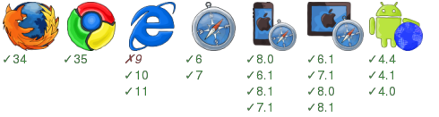

How to try this
===============

1. npm install ../..
2. npm install
3. npm start
4. browse http://localhost:3001/product?id=1
5. click on any related product to go forward with out page loading.
6. click browser back button to see page updates back.

What's in this example
----------------------
* <a href="components/Html.jsx">Html.jsx</a> is the top level ract component with fluxex + history API magic.
* <a href="actions/server.js">A server action</a> contains a start action to render the page.
* <a href="fluxexapp.js">fluxexapp.js</a> defined used stores and the top level react component.
* <a href="server.js">server.js</a> start an express server and use fluxex middleware to serve the sample page at /product.

Used fluxex extra
-----------------
* <a href="fluxexapp.js">fluxexapp.js</a> use the `page` store from <a href="../../extra/commonStores.js">commonStores</a> , this store maintains page location and title.
* <a href="components/Product.jsx">Product.jsx</a> use the `storechange` mixin from <a href="../../extra/storechange.js">storechange.js</a> , this mixin implements default `onStoreChange()` and `getInitialState()` behaviors rely on `getStateFromStores()` .
