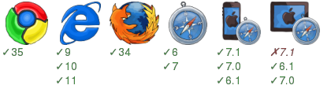

How to try this
===============

1. npm install ../..
2. npm install
3. npm start
4. browse http://localhost:3001/main
5. click on any link of product or 'Go to Main...' link and see pjax!

What's in this example
----------------------
* <a href="components/Html.jsx">Html.jsx</a> is the top level ract component with fluxex magic. In render function you can see component routing logic.
* <a href="fluxexapp.js">fluxexapp.js</a> defined used stores and the top level react component.
* <a href="server.js">server.js</a> start an express server and use fluxex middleware to serve sample pages with a routing action.
* <a href="actions/routing.js">routing.js</a> uses the <a href="https://github.com/aaronblohowiak/routes.js">npm:routes</a> to pick correct page action.
* <a href="actions/page.js">page.js</a> contains all page actions.

Used fluxex extra
-----------------
* <a href="fluxexapp.js">fluxexapp.js</a> use the `page` store from <a href="../../extra/commonStores.js">commonStores</a> , this store maintains page location, title, and routing information. And it used the <a href="../../extra/routeToURL.js">routeToURL()</a> extra function to handle pjax.
* <A href="components/Html.jsx">Html.jsx</a> use the `pjax` mixin from <a href="../../extra/pjax.js">pjax.js</a> , this mixin implements default `componentDidMount()` and `handleClickLink()` to provide pjax behaviors.
