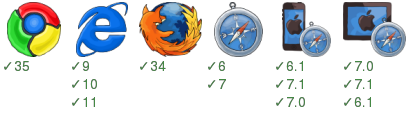
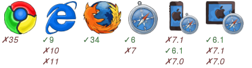
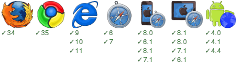

All FluxEx Examples
===================

* <a href="00hello">00hello</a>: A quick start demo works just like <a href="https://github.com/zordius/fluxex/blob/master/SCRATCH.md">Start from Scratch</a> steps.

* <a href="00-simple-single-page">00-simple-single-page</a>: a single page demo shows react server side rendering and client side re-render.

* <a href="01-history-api">01-history-api</a>: single page demo shows react re-rendering triggered by html5 history api push/pop.

* <a href="02-routing">02-routing</a>: a routing example prowerd by <a href="https://github.com/aaronblohowiak/routes.js">npm:routes</a> .

* <a href="03-service">03-service</a>: a single page demo supports pjax and shows how to wrap <a href="https://github.com/request/request">npm:request</a> to `service name` => `api url` mapping, prevents api urls be exposed.

* <a href="04-infinite-scroll">04-infinite-scroll</a>: an youtube search demo support pjax and infinite scroll.

* <a href="05-extra">05-extra</a>: an youtube search site powered by all fluxex extra modules.
